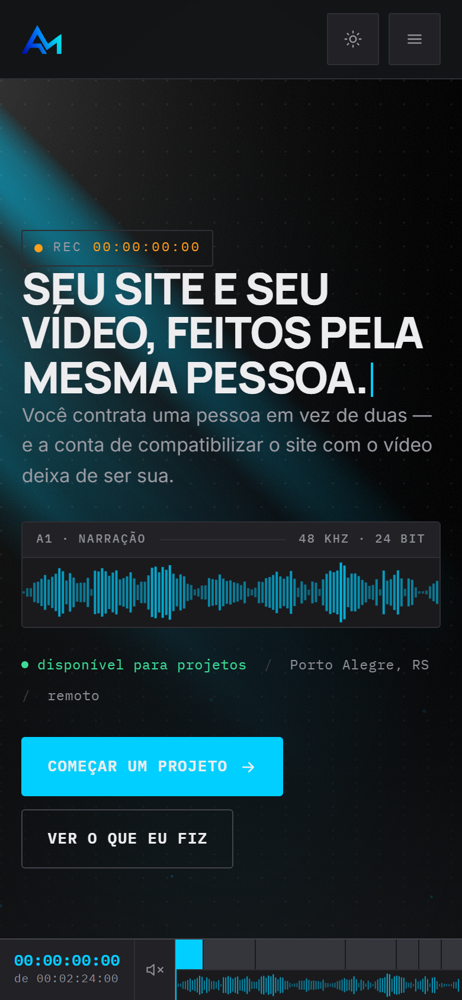

# Portfólio — pixelmartins.com

> Criado em 2026-08-02. Casa oficial do código do site pessoal do Alex Martins.
> Modularizado em 2026-08-03: o fonte é `src/`, o arquivo que se cola é `dist/`.
> **v5 "Sala de Edição" em 2026-08-08:** a página virou uma timeline de edição.
> **v10 em 2026-08-15:** entrou a seção **Vídeo** e o link quebrado saiu.
> Ainda **não publicada** — o widget do Elementor tem a versão de julho.

---

## ⚠️ O que está no ar não é isto

Medido em 15/08/2026 em `pixelmartins.com/portifolio/`: a página no ar é a de
**julho**. Ela mostra **um** projeto real e **dois cartões escritos "Próximo
projeto"** — enquanto há sete projetos publicados e rodando.

Publicar é copiar e colar (ver *Como publicar uma alteração*, abaixo). Nada
disso chega ao visitante enquanto o passo 5 não for feito.

### O que a v10 mudou

| | |
|---|---|
| 🔴 **Link morto** | o cartão "Prato" apontava para `skotalexsander.github.io/prato/`, que virou **404** quando o repositório foi renomeado para `corpo`. O GitHub redireciona a URL do **repositório**, não a do **Pages** |
| 🔴 **Metade da oferta sem prova** | o hero promete *"seu site **e** seu vídeo"* e a página mostrava cinco projetos de código e nenhum frame de vídeo. Entrou a seção **Vídeo** — ver [docs/secoes.md](docs/secoes.md) §4 |
| 🟠 **Rotina entrou** | o projeto tecnicamente mais forte estava fora só porque foi publicado depois desta seção. A faixa virou 2×2 |
| 🟡 **Retrato pelo nome velho** | o `jsDelivr` seguia o redirecionamento do GitHub e funcionava — mas redirecionamento é emprestado, e o dia em que o nome antigo fosse reusado o retrato sumiria **sem erro nenhum** |
| 🟡 **Margem que nunca aplicou** | `.bio-texto { margin-block-start: 1rem }` existia desde a v5 e perdia por especificidade para `#pm-site p { margin: 0 }`. Dois parágrafos colados na seção Sobre, através de quatro rodadas de revisão. Ver o aviso em `src/css/01-tokens-e-base.css` |

As três últimas linhas foram achadas **pela bancada**, não por leitura — e cada
uma virou uma prova nova que reprova se o defeito voltar.

---

## O que é

Site pessoal publicado em **WordPress + Elementor Pro**. A página inteira é um
**único widget HTML** colado numa página com template "Elementor Canvas".

**No ar em <https://pixelmartins.com/portifolio/>** — página de id `13`, slug
`portifolio`. Repare que **não é a raiz do domínio**: `pixelmartins.com` ainda
serve a home padrão do WordPress. Nada no código depende do caminho (os links
são âncoras e os endereços dos frames são absolutos), então mover a página para
a raiz não exige alteração nenhuma aqui.

**Posicionamento (definido em 2026-08-01):** *"site e vídeo, feitos pela mesma
pessoa"* — o diferencial é ser as duas frentes num profissional só, com IA
acelerando o repetitivo.

**Ordem das seções:** Hero → Serviços → Projetos → **Vídeo** → Sobre → IA →
Trajetória → Contato. (A pergunta do visitante é "o que você faz por mim", não
"quem é você" — e as duas metades da promessa provam-se juntas.)

---

## A ideia da v5: a página é uma timeline

Quem rola está arrastando o playhead. A régua fixa no rodapé não é barra de
progresso enfeitada — é **navegação**: timecode ao vivo, um clipe clicável por
seção na faixa V1, forma de onda na A1, e o playhead andando.


Na régua, os clipes são as seções: `COLD OPEN`, `SERVIÇOS`, `PROJETOS`, `VÍDEO`,
`SOBRE`, `IA`, `TRAJETÓRIA`, `CONTATO`. Clicar num deles é ir para a seção; rolar
move o playhead sobre eles. É a mesma peça fazendo as duas coisas.

> **Estas capturas são do `dist/` deste repositório** — a v5, gerada por
> `npm run build` e servida localmente. O widget do Elementor ainda tem a versão
> anterior, como diz o aviso no topo. As imagens mostram o que o código faz, não
> o que o endereço público serve hoje.

**Por que essa direção e não outra:** a página vende *"site e vídeo, feitos
pela mesma pessoa"*. Qualquer um **escreve** isso; só quem faz as duas coisas
**constrói a prova**. É a definição de "único" que se defende: não é único
porque ninguém pensou, é único porque quase ninguém pode executar.

O raciocínio inteiro — cor, tipografia, o que entrou e o que saiu, e por que o
GSAP foi embora — está em **[docs/direcao-arte.md](docs/direcao-arte.md)**.

**Sem biblioteca de terceiro.** A v5 chegou a usar GSAP + ScrollTrigger + Lenis
por CDN e voltou atrás: a bancada mostrou que a página fazia tudo sem eles, e a
decisão já registrada aqui — não depender de terceiro para pintar — continuava
valendo. Hoje `dev/verificar-pagina.js` bloqueia **toda** requisição externa e
cobra que a página continue inteira.

### E no celular

<p align="center">
  
</p>

Em 390px a régua **não é escondida** — os clipes perdem o rótulo e viram blocos,
o timecode e a forma de onda continuam. Uma peça que só existisse em 1440px
seria decoração de desktop, não estrutura, e a primeira coisa que se faz com
decoração é apagá-la no celular.

---

## Estrutura desta pasta

```text
pixelmartins-site/
├── src/               ← O FONTE. É aqui que se edita.
│   ├── html/
│   │   ├── index.html      esqueleto: a ordem da página + marcadores
│   │   ├── parciais/       fontes, navbar, régua
│   │   └── secoes/         hero, servicos, projetos, video, sobre, ia,
│   │                       trajetoria, contato
│   ├── css/           17 arquivos — o prefixo numérico É a ordem da cascata
│   └── js/            13 módulos, cada um uma IIFE independente
├── build/build.js     junta src/ num fragmento único
├── dist/              ← GERADO. É isto que se cola no Elementor. Não editar.
├── assets/frames/     150 frames do retrato do fundo (servidos via jsDelivr)
├── backup/            cópia datada antes de cada alteração — NUNCA sobrescrever
├── dev/               ferramentas de teste local (não vão pro site)
├── docs/              direção de arte, estrutura do código, seções, retrato
└── privado/           notas internas — no .gitignore, não vem no clone
```

**Por que src/ e dist/ separados?** O Elementor exige um fragmento único com
CSS e JS embutidos, mas 2.000 linhas num arquivo só são impossíveis de manter.
A separação vive no fonte; o build refaz o arquivo único.

Dois documentos, e a diferença entre eles é o que você está tentando fazer:

| Se você quer saber | Leia |
|---|---|
| como o código é montado, e por que a ordem do CSS importa | **[docs/estrutura.md](docs/estrutura.md)** — antes de mexer no CSS |
| o que cada seção faz, quais efeitos rodam nela e qual arquivo abrir para mudar X | **[docs/secoes.md](docs/secoes.md)** — antes de mexer no conteúdo |
| por que a página é assim — a direção de arte | **[docs/direcao-arte.md](docs/direcao-arte.md)** |
| como funciona o retrato de 150 frames | **[docs/animacao-retrato.md](docs/animacao-retrato.md)** |

Cada arquivo de `src/html/` também abre com um resumo do que ele é e de quais
efeitos o tocam. Esses cabeçalhos usam `<!--# ... -->`, o comentário
só-do-fonte: o build os remove, então explicar bastante ali não pesa no site.

**Este é um repositório git próprio**, separado do repo-mãe do agente (que o
ignora via `.gitignore`). Publicado em `github.com/SkotAlexsander/pixelmartins`
(renomeado em 15/08/2026 — o nome antigo redireciona, mas não conte com isso).

## Como publicar uma alteração

1. Editar o arquivo certo em **`src/`** (backup datado antes, em `backup/`).
2. `npm run checar` → build + validação sem navegador. Tem de dar **PASSOU**.
3. `npm run preview`, `npm run servir` noutra aba, `npm run verificar`
   → o teste em navegador de verdade. Também tem de dar **PASSOU**.
   O `verificar` roda dois: a página (sem rede externa, sem JavaScript,
   teclado, rolagem lateral em 5 larguras) e o retrato (anima à vista, dorme
   fora dela).
4. `git commit` + `git push` — isso **já atualiza os frames** servidos pelo jsDelivr.
5. Colar o conteúdo de **`dist/index-elementor.html`** no widget HTML do Elementor.

> O passo 3 precisa do Playwright (`npm i -D playwright && npx playwright install
> chromium`). Sem ele, o passo 2 sozinho já pega erro de sintaxe, tag esquecida,
> ID órfão e classe sem estilo.
>
> **Já tem Playwright noutro projeto?** Aponte em vez de baixar 120 MB de novo:
> `PLAYWRIGHT_DIR="C:...
ode_modulesplaywright" npm run verificar`
>
> **Se a porta 8099 estiver ocupada** (outros projetos desta máquina servem
> preview nela), use outra em toda a linha:
> `PORTA=8123 npm run servir` e `PORTA=8123 npm run verificar`.

> O passo 5 continua manual: o Elementor guarda a página num postmeta que a REST
> API não expõe por padrão, então não há como publicar por script sem mexer no
> servidor. As rotas possíveis estão em `privado/conexao-wordpress.md`.

**Regra de ouro:** antes de mexer em qualquer arquivo de `src/`, copiar o
`dist/index-elementor.html` atual pra `backup/` com data no nome
(`AAAA-MM-DD-nome.html`). O backup é a rede de segurança do que já está no ar.

---

## Notas internas ficam fora deste repositório

Este repo é **público** — e por ora precisa ser: o jsDelivr só serve repositório
público, e é ele que entrega os frames do retrato do fundo enquanto eles não
sobem para o WordPress.

Então tudo que é escrito para dentro — pendências, levantamento do servidor,
rascunho de seção — mora em `privado/`, que está no `.gitignore` e nunca é
commitado. Se você clonou este repositório, essa pasta não vem junto: ela é só
da máquina de quem mantém o site.

No código vale a mesma regra: **`<!--# ... -->` é comentário só-do-fonte** — o
build o remove, então ele não chega ao `dist` nem ao código-fonte da página no
ar. Comentário normal (`<!-- ... -->`) continua passando.

---

## Ancestral (não duplicar código)

**`projetos_futuros/portifolio web/`** — versão modular anterior (21/07/2026),
nomeada `skot.dev`, com CSS/JS quebrados em arquivos e `_headers` de segurança.
É o **ancestral**, não o que está no ar. A modularização dele já foi absorvida
aqui (03/08/2026, ver [docs/estrutura.md](docs/estrutura.md)).

---

## Licença

**O código é [MIT](LICENSE)** — pode copiar, estudar, adaptar e usar em
trabalho seu, inclusive comercial. Se a animação do retrato no scroll ou o
esquema de build para o widget do Elementor te servirem, leve.

**O que a licença MIT não cobre**, e fica dito aqui porque um repositório de
portfólio mistura as duas coisas:

| Não coberto | O que é |
|---|---|
| `assets/frames/` | 150 fotos do rosto do autor. São a imagem de uma pessoa, não código |
| Os textos do site | o conteúdo em `src/html/secoes/` — a redação é o trabalho, não o andaime |
| Nome, logo e marca | "pixelmartins", "Alex Martins" e o logotipo |

Ou seja: clonar a estrutura, sim. Republicar com o rosto e os textos do autor,
não. Se for reaproveitar, troque as imagens pelas suas e escreva o seu texto —
que é a parte que faz o site ser de alguém.
